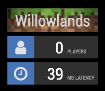
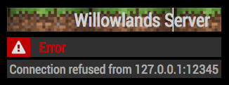

# MMM-MinecraftStatus

A [MagicMirror²](https://magicmirror.builders) module to ping a remote Minecraft server and report how many players are currently on.  If the server can't be reached, this displays an alert.

Example screen showing two instances of MMM-MinecraftStatus config entries, one for Willowlands, and a second for Aliens:




Each entry has two metrics that are periodically updated on a schedule you set in the `config.js` file.  The number of players is retrieved from the server, and the latency is measured as the total round-trip to contact the Minecraft server from the MagicMirror² server.

If MMM-MinecraftStatus can't contact the Minecraft server, it sends an alert message to the alert module.


## Installation

Run these commands at the root of your MagicMirror² install:

```shell
cd modules
git clone https://github.com/ralberth/MMM-MinecraftStatus
cd MMM-MinecraftStatus
npm install
cd ../..
```

This module needs the `npm install` to pick up it's dependencies, including the [minecraft-ping](https://www.npmjs.com/package/minecraft-ping) module that does all the real networking in here.


## Upgrade

If you already have a version of MMM-MinecraftStatus, run the following to pick up new code changes and install necessary dependencies:

```shell
cd MMM-MinecraftStatus
git pull
npm install
cd ..
```


## Configuration

Edit your `config/config.js` file and add a new object to the `modules` array like any other module:

```js
var config = {
    modules: [
        {
            module: 'MMM-MinecraftStatus',
            config: {
                banner: "Red Mountain",           // Banner to display
                hostname: "redmountain.ddns.net", // or IP address
                port: 12345,
                intervalSeconds: 15               // how often to ping the Minecraft server
            }
        }
    ]
}
```


| **Option** | **Default** | **Description** |
| --- | --- | --- |
| `banner` | '`Minecraft Server`'| Name of the server to display on the screen above the number of players and latency.  This length should be rather short, as long values drag the width of the player count and latency wider to match.  Pick something small enough to distinguish one server from another. |
| `hostname` | '`localhost`' | DNS hostname of the Minecraft server to monitor. |
| `port` | `12345` | TCP port the Minecraft server is listening on. |
| `intervalSeconds` | `30` | How often the MagicMirror server should try to ping the Minecraft Server, in seconds. |
| `alertSoundWhenPingFails` | `null` | Name of audio file under `modules/MMM-MinecraftStatus/public/sounds` to play when a ping fails to return valid results, such as if the server is offline, network problems, or host down.  Null means don't play a sound. |
| `alertSoundOnFirstPlayer` | `null` | Name of audio file under `modules/MMM-MinecraftStatus/public/sounds` to play when the server has no players and the most recent ping returned a non-zero value for the number of players.  Used for an idle server to tell you when it's being used.  Null means don't play a sound. |


## Published Messages

Messages published within the browser page by each instance of MMM-MinecraftStatus that is active (isn't covered or had `this.hide()` called on it).


### Minecraft Server Failure: `SHOW_ALERT`

MMM-MinecraftStatus publishes a `SHOW_ALERT` message intended for the built-in alert module.  This is available to all modules that choose to implement `this.receiveNotification()` in their module.

The message is sent whenever a ping to the configured Minecraft server fails for any reason.  The cadence is set by the config entry `intervalSeconds` above.

Attributes of the published object:

* `type`: always set to `notification`
* `title`: always set to the value in the module config entry `banner` above
* `message`: string description of the problem, taken from the minecraft-ping library mentioned above.


## Styling and HTML

Sample of the generated HTML from a browser, so you can restyle anything you like:

```html
<div class="minecraftStatus">
   <div class="title">Willowlands</div>
   <table>
      <tbody class="successSection">
         <tr>
            <td class="iconbox"><i class="fa fa-user fa-fw"></i></td>
            <td class="value">0</td>
            <td class="label">players</td>
         </tr>
         <tr>
            <td class="iconbox"><i class="fa fa-clock-o fa-fw"></i></td>
            <td class="value">9</td>
            <td class="label">ms latency</td>
         </tr>
      </tbody>
      <tbody class="errorSection">
         <tr>
            <td class="iconbox"><i class="fa fa-exclamation-triangle fa-fw"></i></td>
            <td class="errorLabel">Error</td>
         </tr>
         <tr>
            <td class="errorText" colspan="2">blah blah blah</td>
         </tr>
      </tbody>
   </table>
</div>
```


## Translations

MMM-MinecraftStatus is available in the following languages:

* Chinese
* German
* English
* Spanish
* French
* Italian
* Simplified Japanese
* Russian
* Swedish

The original translations were done by me with Google Translate.  If you are a native speaker and have a better translation, please post a pull request!  I'd love to improve on what defaults I could find.  Big thanks to [el97](https://github.com/el97) for the Swedish translation that wasn't done using Google Translate.


## Known Bugs

1. The default timeout is way too long for this use case.  The current minecraft-ping library doesn't have a way to change this, so probably need to swap to another library.
1. If the browser-based timer stops, there is no restart watcher and the display will remain as-is even though there are no current updates.  This leads to false-positives when the display contains stale data.
1. Translations were done mechanically instead of via a native human speaker.
1. This does not work well with older Minecraft servers due to the nature of the different ping protocols defined by Minecraft.
1. There is no backoff/retry logic with the Minecraft server: if it fails, it reports failure and waits the number of `intervalSeconds` before trying again.  This can paint an unduly bad picture for at most `intervalSeconds` seconds before it tries again, even if the server recovered quickly.


## Attributions

### Software

This module is a wrapper around the Node.js module `node-minecraft-ping` available at [www.npmjs.com/package/minecraft-ping](https://www.npmjs.com/package/minecraft-ping).  It was written by GitHub user [deathcap](https://github.com/deathcap) and available in GitHub at [deathcap/node-minecraft-ping](https://github.com/deathcap/node-minecraft-ping).

This is a work by another person covered by the MIT license available [here](https://github.com/deathcap/node-minecraft-ping/blob/master/LICENSE).


### Sounds

The notification sounds in this module were acquired from [Freesound.org](https://freesound.org/) and are covered under the Creative Commons attribution license v3.0.  See [creativecommons.org/licenses](https://creativecommons.org/licenses/by/3.0/) for details on this and what this means for you.  Below are the attributions for each sound file under the `MMM-MinecraftStatus/public/sounds/` folder with any special notes.

These sounds are works by other people, and do not imply or include any warranties.

| **Filename** | **Author** | **Changes Made for MinecraftStatus** |
| --- | --- | --- |
| [alarm-1.mp3](https://freesound.org/people/jobro/sounds/244113/) | [jobro](https://freesound.org/people/jobro) | Converted from ogg to mp3 format |
| [alert-sound.mp3](https://freesound.org/people/philitup321/sounds/204369/) | [philitup321](https://freesound.org/people/philitup321) | Converted from ogg to mp3 format |
| [complete-chime.mp3](https://freesound.org/people/FoolBoyMedia/sounds/352661/) | [FoolBoyMedia](https://freesound.org/people/FoolBoyMedia) | |
| [doorbell-notification.mp3](https://freesound.org/people/TheBuilder15/sounds/415763/) | [TheBuilder15](https://freesound.org/people/TheBuilder15) | Converted from wav to mp3 format |
| [level-up.mp3](https://freesound.org/people/rhodesmas/sounds/320655/) | [rhodesmas](https://freesound.org/people/rhodesmas) | Converted from wav to mp3 format |
| [notification-2.mp3](https://freesound.org/people/ebcrosby/sounds/332651/) | [ebcrosby](https://freesound.org/people/ebcrosby) | Converted from wav to mp3 format |
| [notification-bumptious.mp3](https://freesound.org/people/mickleness/sounds/276609/) | [mickleness](https://freesound.org/people/mickleness) | Converted from wav to mp3 format |
| [notification-chime.mp3](https://freesound.org/people/hykenfreak/sounds/202029/) | [hykenfreak](https://freesound.org/people/TheBuilder15/) | Converted from wav to mp3 format |
| [piano-notification-4.mp3](https://freesound.org/people/FoolBoyMedia/sounds/352650/) | [FoolBoyMedia](https://freesound.org/people/FoolBoyMedia) | |
| [quito-mariscal-sucre-old.mp3](https://freesound.org/people/milton./sounds/81086/) | [milton.](https://freesound.org/people/milton.) | Converted from wav to mp3 format |
| [signal-ring-1.mp3](https://freesound.org/people/Vendarro/sounds/399315/) | [Vendarro](https://freesound.org/people/Vendarro) | Converted from wav to mp3 format |
| [ui-confirmation-alert-b4.mp3](https://freesound.org/people/InspectorJ/sounds/403014/) | [InspectorJ](https://freesound.org/people/InspectorJ) | Converted from wav to mp3 format |


## TO DO

Other ideas and things I'd like to build in eventually.  Feel free to comment and suggest others.

* Send an email or TXT when goes from 0 to non-zero
* Add additional notification messages so other browser modules can react
* Accept other published messages so other modules can control this module
* Automate trying different pingTypes, then keep the one that works
* Config items to control styling
* MUCH faster timeouts!  (mc socket in current library can't do this, switch libs?
* Show logged-in users
